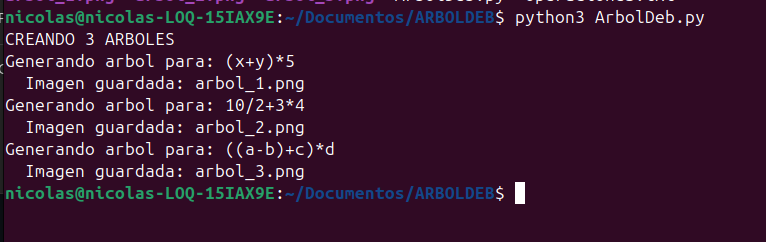
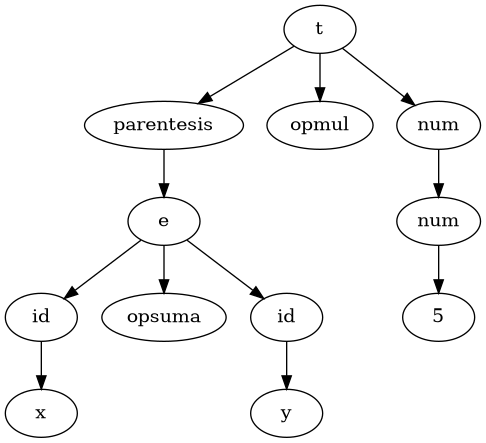
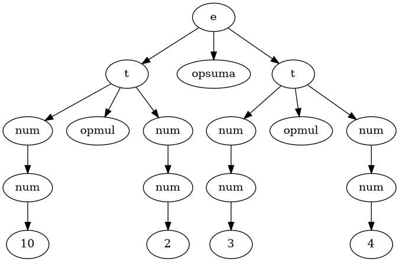
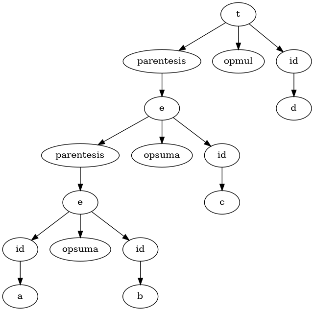

# ARBOL-DERIVACION

**INTRODUCCION**

En este trabajo se desarrolla un programa que analiza expresiones aritméticas y construye su árbol sintáctico. Para esto, se utiliza la librería Lark en Python, que permite definir la gramática y procesar operaciones como suma, resta, multiplicación y división.

Además, con ayuda de Graphviz, los árboles generados se convierten en imágenes, lo que facilita visualizar cómo se organiza cada expresión. De esta forma, se puede entender mejor la estructura interna de las operaciones matemáticas de manera clara y gráfica.

**COMO EJECUTARLO**

se realizo el programa en el sistema operativo de linux ubuntu

**Requisitos**

PASO 1

Instalación del motor de dibujo UBUNTU
 ```bash
  sudo apt update && sudo apt install -y graphviz
  ```
Instalación del motor de dibujo WINDOWS

```bash
  pip install lark pydot
```

Instalacion del motor de dibujo MacOS

```bash
  brew install graphviz
```
PASO 2

Instalacion de librerias en Python UBUNTU

```bash
  pip install lark pydot --break-system-packages
```

Instalacion de librerias en Python MacOS
```bash
pip3 install lark pydot
```

**DESCRIPCION DEL CODIGO**

El programa opera mediante la integración de la librería Lark y el motor Graphviz. En la primera etapa, el sistema utiliza un analizador de tipo LALR para procesar las expresiones basadas en una gramática formal. Esta estructura jerárquica permite que el software identifique correctamente la prioridad de los operadores y maneje la recursividad de las reglas, asegurando que cada elemento de la operación se agrupe según las normas matemáticas de asociación y precedencia.

Una vez validada la sintaxis, el script recorre el árbol generado y lo traduce manualmente a lenguaje DOT, asignando identificadores únicos a cada nodo para evitar redundancias visuales. Finalmente, el programa automatiza la lectura por lotes desde un archivo externo, procesando cada línea de texto y ejecutando un comando de sistema que renderiza la estructura lógica en una imagen de alta resolución. Este flujo garantiza que cualquier expresión compleja se convierta en una representación gráfica clara y precisa en formato PNG.


**RESULTADOS Y PRUEBAS**

**Ejecucion en consola**

Como se observa en la captura de ejecución, el programa lee secuencialmente cada línea del archivo operaciones.txt. Durante el proceso, el sistema notifica en tiempo real qué cadena está analizando y confirma la creación exitosa de cada imagen. Esta fase es crucial para asegurar que no existan errores de sintaxis en las expresiones de entrada y que el motor de renderizado esté respondiendo correctamente.



**Archivos Generados**

Tras la ejecución, el programa organiza los resultados en la carpeta de destino. Como se muestra en el repositorio del proyecto, se generaron tres archivos principales: arbol_1.png, arbol_2.png y arbol_3.png. Cada uno de estos archivos corresponde a una de las expresiones procesadas, demostrando la capacidad del software para manejar múltiples casos de manera automatizada.

**Resultados Visuales**

ARBOL 1



ARBOL 2



ARBOL 3




**ANALISIS**

El análisis de los árboles generados confirma que la gramática respeta estrictamente la jerarquía matemática. Los operadores de menor prioridad, como la suma y la resta, se ubican en la parte superior (raíz), mientras que la multiplicación, la división y los paréntesis se desplazan hacia los niveles inferiores. Esta estructura asegura que, al evaluar el árbol desde las hojas hacia arriba, las operaciones con mayor precedencia se resuelvan primero, eliminando cualquier ambigüedad en el cálculo.

Asimismo, el uso de niveles diferenciados (E, T, F) permite que el programa maneje correctamente tanto valores numéricos como variables. El sistema identifica los paréntesis como factores prioritarios, aislando sub-expresiones que deben procesarse antes de integrarse al resto de la operación. La visualización automática mediante Graphviz valida que cada token ha sido clasificado en su nivel correspondiente, demostrando que el analizador sintáctico interpreta fielmente la lógica de la gramática propuesta.


**CONCLUSION**

El desarrollo de este proyecto permitió aplicar de forma práctica los conceptos de análisis sintáctico y gramáticas libres de contexto. Se logró transformar reglas teóricas en un sistema funcional capaz de interpretar operaciones aritméticas respetando su jerarquía lógica. Esto demuestra que el uso de una estructura basada en niveles (E, T y F) es una solución efectiva para eliminar la ambigüedad en el procesamiento de lenguajes.

Además, la integración de Lark con Graphviz resultó ser una herramienta poderosa para la enseñanza de compiladores. La automatización de los árboles visuales no solo facilita la validación de los resultados, sino que permite observar con precisión cómo la computadora "entiende" y organiza cada componente de una expresión. En conclusión, el programa cumple con el objetivo de procesar, analizar y representar gráficamente cualquier operación matemática definida por la gramática.
